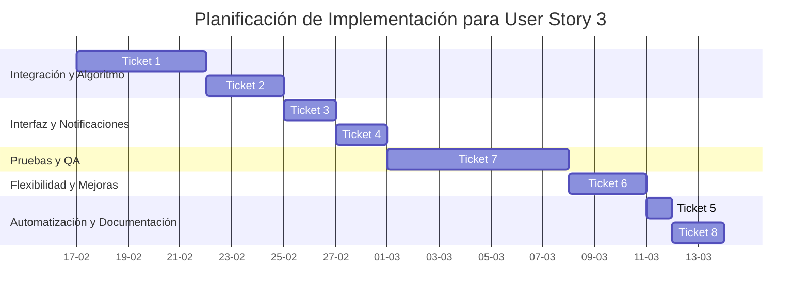

Introducción:
---
Intenté los mismos prompts en 2 asistentes (Claude y Grok) y elegí Grok

### Principales razones de mi elección
- Formato de las tareas
  - Claude tiene un formato más verboso
  - Grok es más conciso
- Calidad de los tickets propuestos
  - Claude creó tickets de trabajo más detallados y los separó en tareas por equipos (backend, frontend, devops, QA). Los tickets abarcan mucho
  - Grok creó menos tickets pero tareas en un orden iterativo al producto. Un ticket exclusivamente para la "cancelación y reagendamiento" deja claro el scope de la tarea
- Coherencia con la realidad respecto al diagrama Gantt
  - Claude puso todas las tareas en paralelo lo cual no es real. El ticket de QA es el que terminó primero que todos. **Aqui tuve que iterar el prompt** para enfatizar que las tareas tienen un proceso de integración y que el QA tiene probar dicha integración también
  - Grok añadió las tareas y priorizó en base a entregar valor más rápido

3 User stories
---
>Como product owner, teniendo en cuenta el documento adjunto, genera 3 user stories siguiendo este template:
>
>1. Formato estándar: "Como [tipo de usuario], quiero [realizar una acción] para [obtener un beneficio]".
>2. Descripción: Una descripción concisa y en lenguaje natural de la funcionalidad que el usuario desea.
>3. Criterios de Aceptación: Condiciones específicas que deben cumplirse para considerar la User Story como "terminada", éstos deberian de seguir un formato similar a “Dado que” [contexto inicial], "cuando” [acción realizada], “entonces” [resultado esperado].
>4. Notas adicionales:  Notas que puedan ayudar al desarrollo de la historia
>5. User stories relacionadas

### User Story 1:

**Formato estándar:**
Como **reclutador**, quiero **publicar una vacante en múltiples portales de empleo** para **alcanzar a un mayor número de candidatos potenciales**.

**Descripción:**
La funcionalidad permite al reclutador crear una vacante una sola vez y distribuirla automáticamente a varios portales de empleo seleccionados.

**Criterios de Aceptación:**
- **Dado que** el reclutador ha ingresado toda la información necesaria de la vacante, **cuando** selecciona la opción para publicar en múltiples portales, **entonces** la vacante debe aparecer en cada uno de los portales especificados.
- **Dado que** se actualiza la descripción de la vacante, **cuando** se guarda el cambio, **entonces** la actualización debe reflejarse en todos los portales donde se publicó originalmente.

**Notas adicionales:**
- Asegurar que la API de integración con cada portal de empleo está configurada correctamente.
- Manejar errores de publicación o sincronización de datos entre diferentes plataformas.

**User stories relacionadas:**
- Gestión de Vacantes

### User Story 2:

**Formato estándar:**
Como **gestor de recursos humanos**, quiero **utilizar un sistema de cribado automático con IA** para **reducir el tiempo dedicado a revisar CV manualmente**.

**Descripción:**
El sistema debe analizar y filtrar automáticamente los currículums recibidos, basándose en los criterios de la vacante, para identificar a los candidatos más adecuados.

**Criterios de Aceptación:**
- **Dado que** hay una nueva vacante con criterios específicos, **cuando** los CVs son ingresados al sistema, **entonces** el sistema debe clasificar y puntuar a los candidatos automáticamente según esos criterios.
- **Dado que** el sistema ha identificado candidatos, **cuando** el gestor revisa la lista, **entonces** debe ver una puntuación y resumen de la adecuación de cada candidato.

**Notas adicionales:**
- Necesidad de entrenamiento continuo del modelo de IA para mejorar la precisión.
- Definir claramente los parámetros de evaluación para distintos tipos de puestos.

**User stories relacionadas:**
- Cribado Automático con IA

### User Story 3:

**Formato estándar:**
Como **manager**, quiero **coordinar entrevistas de manera automatizada** para **minimizar el tiempo dedicado a la logística**.

**Descripción:**
El sistema debe sugerir horarios disponibles para entrevistas, permitir la selección por parte del candidato y enviar recordatorios automáticos.

**Criterios de Aceptación:**
- **Dado que** hay candidatos preseleccionados y horarios disponibles de los entrevistadores, **cuando** el sistema propone horarios, **entonces** los candidatos deben recibir opciones para seleccionar su preferencia.
- **Dado que** un candidato selecciona un horario, **cuando** se confirma, **entonces** ambos, el manager y el candidato, deben recibir confirmaciones y recordatorios automáticos.

**Notas adicionales:**
- Integración con calendarios para evitar conflictos de horarios.
- Configuración de recordatorios con suficiente antelación para reducir no-shows.

**User stories relacionadas:**
- Coordinación de Entrevistas

Estas historias de usuario reflejan las funcionalidades clave del sistema LTI según el documento proporcionado, asegurando una implementación que aborde las necesidades de eficiencia y colaboración en el proceso de reclutamiento.

Tickets de trabajo de la 3ra user story + estimación
---
>Ahora eres un software developer y tienes que definir los tickets de trabajo para la user story 3, estimando las tareas usando fibonacci

Como desarrollador de software, aquí están los tickets de trabajo para la **User Story 3: Coordinación de Entrevistas**, con estimaciones en la serie de Fibonacci:

### User Story 3: Coordinación de Entrevistas

**Descripción:**
El sistema debe sugerir horarios disponibles para entrevistas, permitir la selección por parte del candidato y enviar recordatorios automáticos.

#### Ticket 1: Integración con Calendarios

**Título:** Integrar sistema con APIs de calendarios (Google Calendar, Outlook)
- **Descripción:** Implementar la integración con servicios de calendario para obtener y sincronizar disponibilidades de entrevistadores.
- **Estimación:** 8 (considerando la autenticación, permisos y manejo de sincronización de múltiples calendarios)

#### Ticket 2: Algoritmo de Sugerir Horarios

**Título:** Desarrollar algoritmo para sugerir horarios de entrevista
- **Descripción:** Crear lógica que analice las disponibilidades de entrevistadores y candidatos para proponer horarios de entrevista.
- **Estimación:** 5 (manejo de conflictos de horario, preferencias, y duración de entrevistas)

#### Ticket 3: Interfaz de Selección de Horario

**Título:** Implementar interfaz de usuario para la selección de horarios
- **Descripción:** Desarrollar una interfaz donde los candidatos puedan ver y seleccionar los horarios sugeridos.
- **Estimación:** 3 (diseño y funcionalidad básica de selección)

#### Ticket 4: Confirmación y Notificación

**Título:** Sistema de confirmación de entrevista y notificaciones
- **Descripción:** Crear un sistema que confirme la entrevista una vez seleccionado el horario y envíe notificaciones a ambas partes.
- **Estimación:** 3 (envío de emails o notificaciones push)

#### Ticket 5: Automatización de Recordatorios

**Título:** Configurar automatización de recordatorios de entrevista
- **Descripción:** Implementar una tarea cron o similar para enviar recordatorios automáticos antes de la entrevista.
- **Estimación:** 2 (configuración de cron jobs o servicios de notificación programada)

#### Ticket 6: Manejo de Cancelaciones y Reagendamientos

**Título:** Desarrollar funcionalidades para cancelar y reagendar entrevistas
- **Descripción:** Permitir a los usuarios cancelar o cambiar la cita de entrevista, actualizando los calendarios y enviando notificaciones.
- **Estimación:** 5 (gestión de flujos de trabajo complejos, actualización de datos y notificaciones)

#### Ticket 7: Pruebas y QA

**Título:** Realizar pruebas unitarias, de integración y QA para la funcionalidad de coordinación de entrevistas
- **Descripción:** Asegurar que todas las partes del sistema funcionan correctamente juntas y que la experiencia del usuario es fluida y libre de errores.
- **Estimación:** 13 (pruebas exhaustivas, incluyendo edge cases, integración de sistemas y pruebas de usuario)

#### Ticket 8: Documentación y Monitoreo

**Título:** Documentar el sistema de coordinación de entrevistas y configurar monitoreo
- **Descripción:** Documentar API endpoints, flujos de trabajo, y configurar monitoreo para detectar fallos o cuellos de botella.
- **Estimación:** 3 (documentación técnica y configuración de herramientas de monitoreo)

**Total Estimado:** 42 puntos Fibonacci

Estas estimaciones están basadas en la complejidad y el tiempo esperado para cada tarea, usando la serie de Fibonacci para reflejar la incertidumbre y el esfuerzo relativo. La suma de puntos no indica necesariamente el total de tiempo de desarrollo, sino la complejidad y prioridad relativa de las tareas.

Priorización de los tickets de trabajo + diagrama Gantt
---
>Prioriza los tickets de trabajo para poder terminar la user story en el menor tiempo posible, dando un diagrama gant en mermaid
>
>Utiliza en la priorización los siguientes criterios por ticket trabajo y represéntalo en una tabla
>- Impacto en el usuario y valor del negocio
>- Urgencia basada en tendencias del mercado y feedback de usuarios
>- Complejidad y esfuerzo estimado de implementación
>- Riesgos y dependencias entre tareas

Para priorizar los tickets de trabajo, utilizaré los criterios especificados y luego crearé un diagrama de Gantt en Mermaid para visualizar la planificación. Aquí está el análisis de priorización:

### Tabla de Priorización

| **Ticket**                                | **Impacto en Usuario / Valor Negocio** | **Urgencia** | **Complejidad / Esfuerzo** | **Riesgos / Dependencias** | **Prioridad** |
|------------------------------------------|----------------------------------------|--------------|----------------------------|----------------------------|---------------|
| 1. Integración con Calendarios           | Alto (base de la funcionalidad)        | Alta         | 8                          | Alto (integración externa) | Alta          |
| 2. Algoritmo de Sugerir Horarios         | Alto (core del sistema)                | Alta         | 5                          | Medio (depende de Ticket 1)| Alta          |
| 3. Interfaz de Selección de Horario      | Alto (interacción directa con usuario) | Media        | 3                          | Bajo (independiente)       | Media         |
| 4. Confirmación y Notificación           | Medio (mejora experiencia)             | Media        | 3                          | Medio (depende de Ticket 3)| Media         |
| 5. Automatización de Recordatorios       | Medio (mejora eficiencia)              | Baja         | 2                          | Bajo (independiente)       | Baja          |
| 6. Manejo de Cancelaciones y Reagendamientos | Medio (flexibilidad para usuarios) | Media        | 5                          | Alto (depende de Tickets 1 y 2)| Media      |
| 7. Pruebas y QA                          | Alto (garantía de calidad)             | Alta         | 13                         | Alto (depende de todos)    | Alta          |
| 8. Documentación y Monitoreo              | Bajo (posterior a implementación)      | Baja         | 3                          | Bajo (independiente)       | Baja          |

### Prioridad explicada:

- **Alta:** Tickets 1, 2, y 7 son críticos para la funcionalidad básica y la calidad del producto, por lo que se deben abordar primero.
- **Media:** Tickets 3, 4, y 6. Estos son importantes para la experiencia del usuario pero pueden esperar un poco más después de los básicos.
- **Baja:** Tickets 5 y 8. Estos mejoran el sistema pero no son esenciales para la funcionalidad mínima viable.

### Diagrama de Gantt en Mermaid

**Notas sobre el Diagrama de Gantt:**

- Cada tarea comienza inmediatamente después de que la tarea previa en la que depende se haya completado, lo cual es una simplificación; en la práctica, podría haber más solapamiento o paralelización.
- La duración de las tareas se basa en las estimaciones en días laborables, asumiendo que cada día de esfuerzo corresponde a aproximadamente 8 puntos Fibonacci en complejidad para proporcionar una progresión temporal.
- La prueba y QA se colocan después de la implementación principal porque, aunque son críticas, deben realizarse una vez que el código base esté en un estado funcional.

Este plan permite una implementación rápida de la funcionalidad básica mientras asegura la calidad del producto con pruebas y QA.
